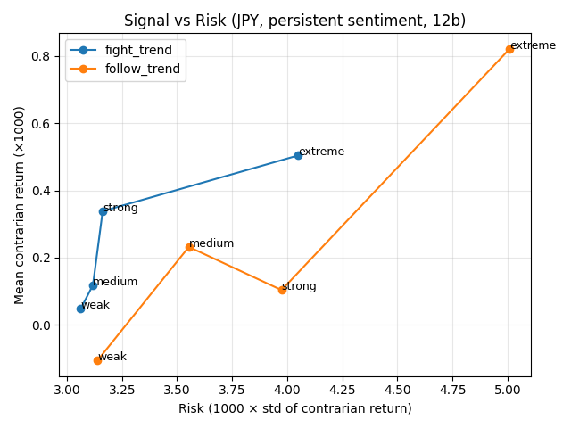
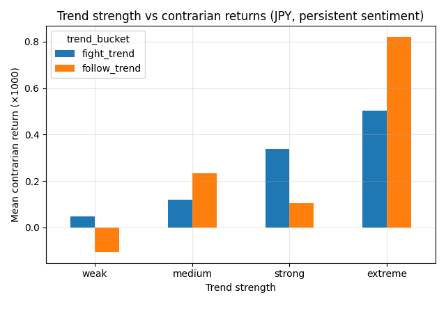
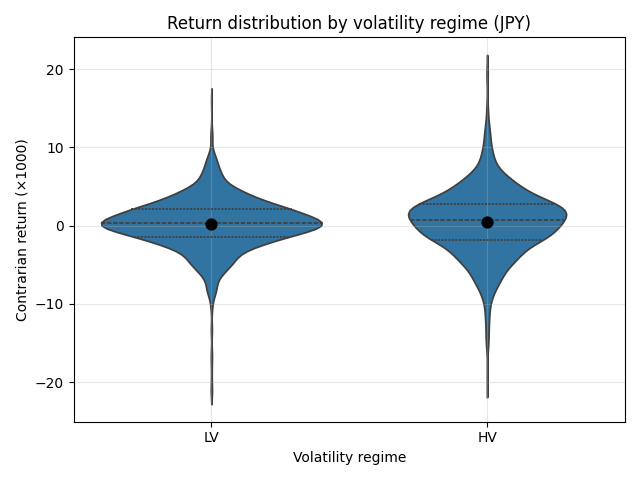
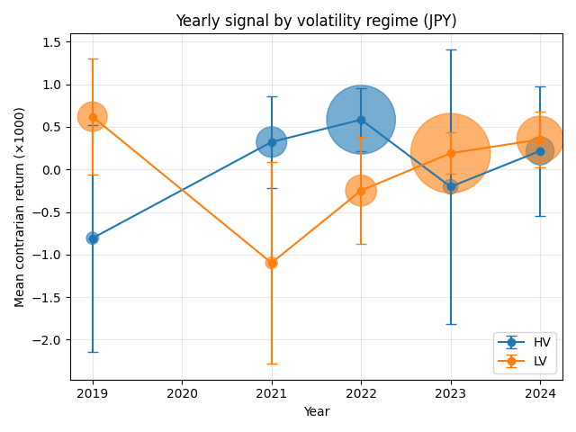

# FX Retail Sentiment Research Pipeline

A research pipeline for combining multi-year retail FX sentiment snapshots with hourly FX market data, producing a clean event-level dataset for signal testing and downstream ML workflows.

---

## Executive summary

This project builds and validates a research pipeline for testing whether **retail FX sentiment** contains predictive information.

It demonstrates an end-to-end quantitative workflow:

- large-scale data ingestion and normalization  
- timestamp alignment across heterogeneous sources  
- feature engineering and target construction  
- data-quality diagnostics and filtering  
- structured signal validation (permutation, holdout, walk-forward)  

### Main result

After correcting for methodological biases (notably overlapping signals) and applying strict walk-forward validation:

> **No robust predictive edge remains when conditioning on price-based regimes**  
> (volatility, trend, trend strength, or macro period)

Earlier findings suggesting regime-dependent effects were driven by:

- overlapping signal exposure  
- in-sample bias  
- regime clustering in specific time periods  

### Current interpretation

The absence of price-regime effects suggests:

> The signal, if it exists, is not governed by market state, but by **crowd behavior dynamics**

This motivates a shift from:

> price-conditioned signal analysis  

to:

> **crowd-conditioned regime modeling (Regime v2)**

The repository therefore represents both:

- a validated research pipeline  
- and a documented negative result that redirects the research toward behavioral regime modeling

---

## Research idea

The core question is whether **retail crowd positioning in FX** contains predictive information.

The working hypothesis is contrarian but conditional:

- extreme positioning may be exploitable  
- persistence may matter  
- context may determine when the effect appears  

The goal of this repository is not to present a trading strategy, but to show how to move from raw data to a **structured, testable hypothesis**.

---

## What the pipeline does

The pipeline transforms raw sentiment snapshots and FX price data into a clean research dataset:

- aggregates multi-year sentiment snapshots  
- parses timestamps and aligns timezones  
- normalizes pair naming across sources  
- merges sentiment to hourly price bars using forward alignment  
- computes trading-bar forward returns  
- constructs contrarian return targets  
- builds persistence and behavioral features  

It also produces an **hourly feature contract** (`sentiment_features_h1_v1`) for downstream ML use.

---

## Key findings

### 1. No robust aggregate effect

After cleaning and validation:

- simple contrarian sentiment thresholds show weak or inconsistent performance  
- major pairs are largely flat  
- thin/exotic pairs are unstable  

There is no broad, unconditional sentiment edge.

---

### 2. Initial structured patterns (exploratory only)

Exploratory analysis suggested:

- concentration in JPY crosses  
- dependence on persistent extreme sentiment  
- apparent conditioning on volatility and trend  

However, these findings did not survive strict validation.

---

### 3. Regime effects collapse under proper validation

After enforcing:

- non-overlapping signals  
- true walk-forward evaluation  
- regime holdout testing  

the following effects **disappear**:

- volatility regime (HV vs LV)  
- trend alignment (fight vs follow)  
- trend strength buckets  
- macro regime (pre/post 2022)  

All converge to approximately:

- mean ≈ 0  
- Sharpe ≈ 0  
- hit rate ≈ 50%  

---

### 4. Interpretation

The failure of price-based regimes suggests:

> The sentiment signal is not a function of market state (price), but of **crowd state (behavior)**

This implies that:

- volatility and trend are insufficient conditioning variables  
- previously observed effects were artifacts of sampling and clustering  

---

### 5. New research direction

The focus shifts toward **behavioral regime modeling**, including:

- persistence of crowd positioning  
- acceleration of sentiment changes  
- crowd saturation and imbalance  
- loss-driven behavior (trapped positioning)  

These dimensions are not captured by traditional price regimes and form the basis for **Regime v2**.

---

## Figures

### Figure 1: Signal vs Risk (JPY crosses)



The relationship between signal strength and risk is non-linear.

- Weak signals exhibit low variance but limited return  
- Extreme signals show higher variance but improved mean return  
- The signal appears strongest during rare, high-intensity crowd states  

---

### Figure 2: Trend strength vs contrarian returns



Contrarian performance varies across trend strength levels.

However, these differences do not persist under strict walk-forward validation and are not statistically robust.

They are interpreted as **sampling artifacts rather than stable regime effects**.

---

### Figure 3: Volatility regime dependency



*The violin shape shows the full return distribution, while the overlaid markers indicate mean values with 95% confidence intervals.*

Differences in return distributions appear across volatility regimes.

However, these effects **do not survive proper walk-forward validation** and are not statistically robust.

They are therefore interpreted as **artifacts of regime clustering and sampling**, not true gating mechanisms.

---

### Figure 4: Signal evolution over time



*Marker size reflects the number of observations per year. Error bars indicate 95% confidence intervals.*

The signal exhibits strong time variation.

However, this variation does not translate into a stable predictive effect under walk-forward validation.

Year-to-year differences are interpreted as **non-stationarity rather than exploitable regime structure**.

---

## Validation status

The signal has been tested using:

- pair-level outlier filtering  
- subgroup analysis  
- permutation testing  
- time-based holdout  
- strict walk-forward validation (non-overlapping signals)  

### Result

After correcting for overlapping signals and enforcing proper walk-forward evaluation:

- no statistically robust predictive edge remains  
- no regime conditioning (volatility, trend, macro) improves performance  

### Interpretation

This constitutes a **negative result**:

> price-based regime conditioning does not explain sentiment behavior

The remaining hypothesis is that any potential edge must be:

> **conditional on crowd behavior, not market structure**

---

## Current interpretation

The evidence suggests:

- retail traders are not uniformly wrong  
- apparent failures depend on behavioral dynamics rather than price regimes  

The signal, if present, is likely driven by:

- persistence of positioning  
- crowd imbalance buildup  
- behavioral feedback loops  

This reframes sentiment from:

> a regime-conditioned contrarian signal  

to:

> a **behaviorally-conditioned phenomenon requiring new regime definitions**

---

## Next step: Regime v2 (behavioral regimes)

Given the failure of price-based regimes, the next phase introduces a new regime layer based on crowd behavior:

Planned features:

- crowd persistence (duration of extreme positioning)  
- sentiment acceleration (rate of change)  
- crowd saturation (position imbalance)  
- loss regimes (crowd trapped vs profitable)  

Goal:

> identify whether sentiment becomes predictive when conditioned on **crowd state rather than price state**

---

## Running the project

### 1. Build the research dataset

```bash
python build_fx_sentiment_dataset.py
```

### 2. Run exploratory analysis and validation

Examples:

```
python analyze_thresholds.py
python analyze_outliers.py
python analyze_pair_quality.py
python analyze_by_pair_group.py
python analyze_persistence.py
python analyze_cross_pair_persistence.py
python analyze_jpy_cluster_permutation.py
python validate_jpy_effect_time_split.py
python validate_jpy_effect_walkforward.py
```

These scripts generate summary tables and validation outputs under `data/output/analysis/`.

---

## Output artifact contract

The pipeline now defines a stable output contract for downstream integration.

Key documents:

- `INPUT_SCHEMA.md`
- `OUTPUT_SCHEMA.md`


A machine-readable dataset manifest is written at build time:

- `data/output/DATASET_MANIFEST.json`


The canonical downstream research artifact is:

- `data/output/master_research_dataset_core.csv`


unless otherwise stated.

------

## License and data availability

This repository is distributed under a **non-commercial, source-available license** for the original code and repository-authored documentation.

- Personal, educational, academic, and non-commercial research use is allowed
- Commercial use, resale, sublicensing, and inclusion in paid products or services is not allowed without prior written permission

### Data availability

Raw broker-exported FX price data, raw sentiment scrape files, and full derived datasets are **not distributed** in this repository due to licensing and redistribution uncertainty.

The repository contains the code and documentation needed to reproduce the pipeline using data that you have the right to access and use locally.

------

## Project structure

```
.
├── analyze_by_pair_group.py
├── analyze_cross_pair_persistence.py
├── analyze_jpy_cluster_permutation.py
├── analyze_outliers.py
├── analyze_pair_quality.py
├── analyze_persistence.py
├── analyze_regime_signal_interaction.py
├── analyze_thresholds.py
├── analyze_trend_alignment.py
├── analyze_trend_behavior.py
├── analyze_trend_strength_results.py
├── attach_regimes_to_h1_dataset.py
├── build_fx_sentiment_dataset.py
├── build_sentiment_feature_contract.py
├── data
│   ├── input
│   │   ├── fx
│   │   └── sentiment
│   ├── output
│   │   ├── analysis/
│   │   ├── DATASET_MANIFEST.json
│   │   ├── features
│   │   │   ├── SENTIMENT_FEATURE_MANIFEST_h1_v1.json
│   │   │   └── sentiment_features_h1_v1.parquet
│   │   ├── master_research_dataset_core.csv
│   │   ├── master_research_dataset.csv
│   │   ├── master_research_dataset_extended.csv
│   │   ├── master_research_dataset_with_regime.csv
│   │   └── pair_coverage_summary.csv
│   └── sample
│       ├── fx
│       └── sentiment
├── docs
│   ├── images
│   │   ├── hv_vs_lv_signal_jpy.png
│   │   ├── signal_vs_risk_jpy.png
│   │   ├── trend_strength_jpy.png
│   │   └── yearly_signal_jpy.png
│   └── SENTIMENT_FEATURE_SCHEMA.md
├── DATA_AVAILABILITY.md
├── evaluate_signal_regime_aware.py
├── INPUT_SCHEMA.md
├── JPY_BEHAVIORAL_HYPOTHESIS.md
├── LICENSE
├── OUTPUT_SCHEMA.md
├── PRE_REGISTERED_JPY_EFFECT_TEST.md
├── PROJECT_DESCRIPTION.md
├── README.md
├── validate_jpy_effect_preregistered.py
├── validate_jpy_effect_time_split.py
├── validate_jpy_effect_walkforward.py
├── walk_forward_jpy_hypothesis.py
└── walk_forward_jpy_regime_signal.py
```

Note: `data/input/` and `data/output/` are **expected local directories** and are not distributed with the repository.