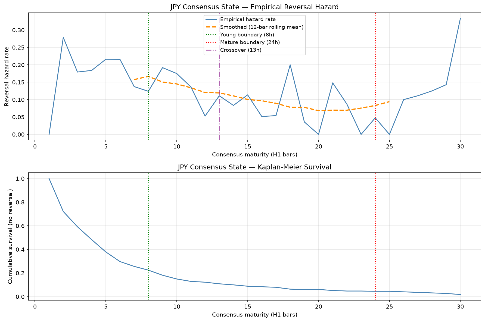
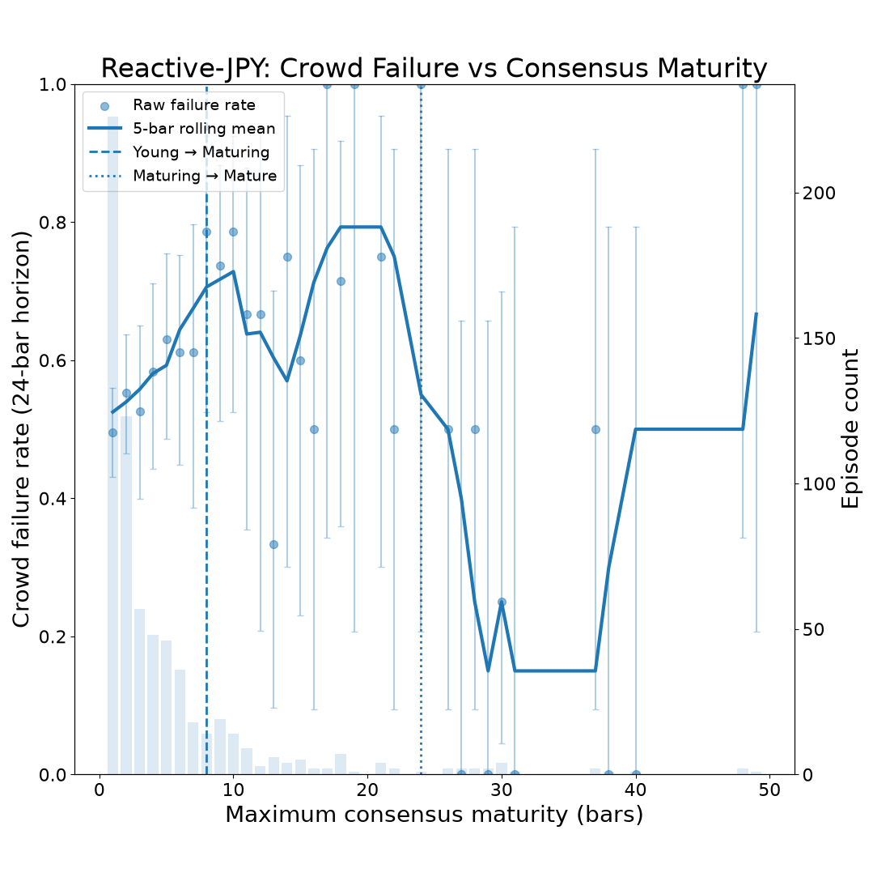

# Reactive-JPY Findings

Research status: Exploratory
Dataset window: 2019–2026
Hypothesis generation: Same dataset
Independent validation: Not yet performed

---

## Purpose

This document records empirical findings, calibration results, validation outcomes, and research observations related to the Reactive-JPY ontology.

Unlike `CONCEPT_DRAFT.md`, this document is expected to evolve as new evidence is gathered.

---

# Ontology Summary

Reactive-JPY models the lifecycle of extreme crowd consensus states.

The current ontology contains:

* `JPY_CONSENSUS_YOUNG`
* `JPY_CONSENSUS_MATURING`
* `JPY_CONSENSUS_MATURE`
* `JPY_NON_EXTREME`

State transitions are driven by consensus persistence duration calibrated from historical sentiment behavior.

---



**Figure: Empirical reversal hazard and consensus-state calibration (Reactive-JPY).**

The upper panel shows the empirical probability that a consensus episode terminates (reverses) at each maturity level, measured in hourly bars. The blue line shows the observed reversal hazard rate, while the orange dashed line shows a 12-bar rolling average used to identify broad structural trends. The green vertical line marks the Young boundary (8 bars), the red vertical line marks the Mature boundary (24 bars), and the purple line indicates the approximate crossover point (~13 bars) identified during calibration analysis.

The lower panel shows the Kaplan–Meier survival curve for consensus episodes. The y-axis represents the probability that a consensus episode remains active without reversal as maturity increases. Rapid early decay indicates that most consensus episodes terminate within the first several hours, while a small minority survive long enough to reach advanced maturity states.

Together, the hazard and survival curves provide the empirical basis for the Reactive-JPY ontology. The Young, Maturing, and Mature state boundaries were selected from observed episode-lifecycle dynamics rather than imposed *a priori*. The Young→Maturing transition occurs near the region where reversal risk begins to stabilise, while the Mature boundary identifies a small population of unusually persistent consensus episodes.

# Calibration Results

## Dataset

Calibration performed on:

* Dataset version: 1.5.1
* Window: 2019–2026
* Pairs:

  * USDJPY
  * EURJPY
  * GBPJPY

## Derived Thresholds

| Parameter         | Value   |
| ----------------- | ------- |
| Extreme threshold | 70      |
| Young boundary    | 8 bars  |
| Mature boundary   | 24 bars |
| Hazard crossover  | 13 bars |

## Episode Statistics

| Metric              | Value  |
| ------------------- | ------ |
| Total episodes      | 441    |
| Median duration     | 4 bars |
| Survival to 8 bars  | 113    |
| Survival to 24 bars | 21     |
| Survival to 48 bars | 3      |

Observations:

* Reversal hazard is strongly front-loaded.
* Most consensus episodes terminate quickly.
* Mature consensus states are rare.
* Hazard structure supports a young/non-young distinction.

---

# State Assignment Results

State assignment executed successfully on dataset v1.5.1.

Observed state distribution:

| State                  | Observations |
| ---------------------- | ------------ |
| JPY_NON_EXTREME        | 6616         |
| JPY_CONSENSUS_YOUNG    | 2198         |
| JPY_CONSENSUS_MATURING | 798          |
| JPY_CONSENSUS_MATURE   | 209          |

Observations:

* Mature states are sparse but present across all JPY pairs.
* State assignment reproduces calibration statistics.
* Survival counts match calibration expectations.

---

# Criterion 1 Investigation

## Duration-Based Validation

Duration distributions differ significantly between maturity states.

KS tests consistently identify strong separation between:

* Young vs Maturing
* Young vs Mature

However, duration-based evidence is not considered independent validation because maturity states are themselves defined using persistence duration.

Result:

**INCONCLUSIVE**

---

# Outcome Discovery Studies (June 2026)

Following the initial Criterion 1 investigation, a series of exploratory outcome-discovery studies were performed to identify candidate independent behavioral outcomes for Reactive-JPY.

These studies are descriptive only and must not be interpreted as validation because they were conducted on the same DL-active window used during ontology development.

## Magnitude-Based Outcomes

Multiple volatility-adjusted outcome definitions were evaluated:

```text
SUCCESS if |return_24b| >= k × vol_48b
```

for:

- k = 1
- k = 2
- k = 3
- k = 4
- k = 5

Observations:

- Outcome distributions were highly similar across maturity states.
- State separation remained weak regardless of threshold.
- Magnitude-based outcomes do not currently appear to capture the primary behavioral distinction represented by the ontology.

Current assessment:

**Low priority.**

------

## Directional Continuation Outcomes

Continuation and reversal outcomes were evaluated across horizons:

- 1 bar
- 2 bars
- 4 bars
- 6 bars
- 12 bars
- 24 bars
- 48 bars

A notable separation was observed at 24–48 bars:

| State    | Continuation (24b) |
| -------- | ------------------ |
| Young    | 45.8%              |
| Maturing | 29.3%              |
| Mature   | 61.9%              |

However:

- The effect was not consistently present across shorter horizons.
- Mature observations remain sparse.
- The temporal pattern does not yet support a clear lifecycle interpretation.

Current assessment:

**Interesting but inconclusive.**

------

## Return Distribution Analysis

Future return distributions were examined directly rather than through binary outcome labels.

At both 24-bar and 48-bar horizons:

- Young episodes were approximately neutral.
- Maturing episodes exhibited consistently more positive future returns.
- The effect was observed across EURJPY, GBPJPY, and USDJPY.

Examples (24-bar horizon):

| Pair   | Young Mean | Maturing Mean |
| ------ | ---------- | ------------- |
| EURJPY | -0.05%     | +0.14%        |
| GBPJPY | +0.03%     | +0.22%        |
| USDJPY | +0.04%     | +0.16%        |

The same directional relationship persisted at 48 bars.

Additional observations:

- Median returns also increased for Maturing episodes.
- The improvement was not confined to the upper tail.
- The entire return distribution appears shifted upward relative to Young episodes.

Current assessment:

**Most promising outcome family identified so far.**

------

## Episode Lifecycle Findings

Consensus episode reconstruction produced:

| Terminal State | Episodes |
| -------------- | -------- |
| Young          | 554      |
| Maturing       | 92       |
| Mature         | 21       |

Observations:

- Most consensus episodes terminate in the Young state.
- Only a minority survive long enough to become Maturing.
- Mature episodes are rare.
- The lifecycle funnel observed during calibration is reproducible in state-surface artifacts.

Current exit-event labels are derived from ontology logic and therefore cannot be used as independent behavioral evidence.

Future exit-mechanism studies should focus on raw episode characteristics rather than BSVE-generated outcome labels.

------

## Crowd-Relative Outcome Analysis

A second outcome-discovery study transformed future returns into crowd-relative outcomes.

Definition:

crowd_relative_return =
    crowd_side × future_return

Interpretation:

* Positive values indicate crowd success.
* Negative values indicate crowd failure.

An initial implementation incorrectly used:

    (-crowd_side) × future_return

which inverted outcome interpretation. The issue was identified through manual sanity checks and corrected before analysis continued.

### Crowd Success Rates

24-bar horizon:

| State    | Success | Failure |
| -------- | ------: | ------: |
| Young    |   45.8% |   54.2% |
| Maturing |   29.3% |   70.7% |
| Mature   |   61.9% |   38.1% |

48-bar horizon:

| State    | Success | Failure |
| -------- | ------: | ------: |
| Young    |   42.9% |   57.1% |
| Maturing |   31.9% |   68.1% |
| Mature   |   38.1% |   61.9% |

Observations:

* Maturing episodes exhibit substantially higher crowd-failure rates than Young episodes.
* The effect appears at both 24-bar and 48-bar horizons.
* The effect survives transformation from raw returns to crowd-relative outcomes.
* Mature-state results remain difficult to interpret because of limited sample size.

---

## Pair Decomposition

Crowd-failure outcomes were examined separately for EURJPY, GBPJPY, and USDJPY.

24-bar horizon:

| Pair   | Young Failure | Maturing Failure | Difference |
| ------ | ------------: | ---------------: | ---------: |
| EURJPY |         51.6% |            71.4% |     +19.8% |
| GBPJPY |         55.7% |            68.2% |     +12.4% |
| USDJPY |         56.3% |            71.4% |     +15.1% |

48-bar horizon:

| Pair   | Young Failure | Maturing Failure | Difference |
| ------ | ------------: | ---------------: | ---------: |
| EURJPY |         54.8% |            68.3% |     +13.5% |
| GBPJPY |         57.9% |            68.2% |     +10.3% |
| USDJPY |         59.3% |            67.9% |      +8.5% |

Observations:

* All three JPY pairs show the same directional relationship.
* Maturing failure rates exceed Young failure rates for every pair tested.
* The effect weakens somewhat at 48 bars but remains directionally consistent.
* The result is not driven by a single currency pair.

---

## Statistical Assessment

Young vs Maturing crowd-failure rates were compared using contingency-table methods.

### 24-Bar Horizon

| Metric                  |                   Value |
| ----------------------- | ----------------------: |
| Fisher p-value          |                  0.0032 |
| Chi-square p-value      |                  0.0047 |
| Odds ratio              |                    0.49 |
| Failure-rate difference | +16.4 percentage points |

### 48-Bar Horizon

| Metric                  |                   Value |
| ----------------------- | ----------------------: |
| Fisher p-value          |                   0.051 |
| Chi-square p-value      |                   0.061 |
| Odds ratio              |                    0.62 |
| Failure-rate difference | +11.0 percentage points |

Interpretation:

* The 24-bar effect is statistically significant in exploratory testing.
* The 48-bar effect is weaker but remains directionally consistent.
* Results should be interpreted as outcome discovery rather than validation because the hypothesis emerged during exploratory analysis.

---

# Current Interpretation

The strongest behavioral distinction identified so far is not volatility magnitude, but crowd-failure probability.

Reactive-JPY Maturing episodes appear substantially more likely than Young episodes to experience crowd-unfavorable outcomes over subsequent 24–48 bar horizons.

The effect:

* survives pair decomposition,
* survives horizon variation,
* survives transformation to crowd-relative outcomes,
* exhibits exploratory statistical support at 24 bars.

Current working hypothesis:

> Maturing consensus episodes represent a vulnerable consensus state in which crowd positioning is more likely to fail than during newly established consensus episodes.

This hypothesis remains exploratory and requires future independent validation.

---



**Figure: Crowd-failure rate as a function of consensus maturity (Reactive-JPY).**

The x-axis shows the maximum maturity reached by a consensus episode before termination, measured in hourly bars. A maturity of 1 indicates that consensus failed almost immediately, while higher values indicate longer-lived consensus episodes.

The y-axis shows the proportion of episodes that subsequently produced a crowd-unfavourable outcome over a 24-bar horizon. A crowd-failure occurs when price movement over the following 24 hours moves against the majority trader positioning implied by sentiment data.

Blue points show observed failure rates at each maturity level. Vertical error bars show 95% Wilson confidence intervals. The dark blue curve shows a 5-bar rolling average used only for visualisation. Grey bars indicate the number of episodes contributing to each maturity level. The dashed vertical line marks the Young→Maturing boundary (8 bars) and the dotted vertical line marks the Maturing→Mature boundary (24 bars).

Failure rates appear to increase as maturity approaches the Young→Maturing boundary, consistent with the state-level finding that Maturing episodes exhibit higher crowd-failure rates than Young episodes. Beyond approximately 12–15 bars, sample sizes become sparse and maturity-level estimates should be interpreted cautiously.

---

### Reframing the Maturity States

The calibration defined maturity states in terms of survival duration.
The outcome discovery studies suggest a different interpretation:

- JPY_CONSENSUS_YOUNG: Episodes where crowd positioning is still being established. Crowd failure rate is only modestly elevated (~54–57%), suggesting that newly formed consensus episodes are not yet strongly associated with systematic crowd failure.
  
- JPY_CONSENSUS_MATURING: Episodes where crowd positioning has survived initial reversal pressure and consolidated. Crowd failure rate rises to ~68-71%. The crowd has committed, and that commitment appears to be associated with a substantially higher probability of subsequent crowd failure.

This is consistent with the consensus formation → maturation → decay chain described in RESEARCH_STATE.md, but gives it a specific mechanistic interpretation: maturation may represent the point at which crowd positioning becomes overextended rather than merely persistent. 

This interpretation is speculative and requires independent validation.

---

# Frozen Findings (June 2026)

The following findings are considered stable enough to record and carry forward:

1. Magnitude-based outcome families show little differentiation between maturity states.
2. Duration-derived outcomes are not independent of the ontology and cannot support validation.
3. Maturing episodes exhibit elevated crowd-failure rates relative to Young episodes.
4. The crowd-failure effect is present across EURJPY, GBPJPY, and USDJPY.
5. The strongest observed outcome family is crowd-failure probability at approximately 24 bars.

Reactive-JPY outcome discovery is therefore considered provisionally complete.

Future work should focus on validation and cross-family comparison rather than continued outcome searching.

---

# Next Research Priority

Reactive-CHF.

Primary question:

> Does Reactive-CHF exhibit an analogous crowd-failure phenomenon, or is the Reactive-JPY result specific to JPY markets?

Reactive-JPY will remain frozen unless future validation work requires additional investigation.

---

# Current Status

Framework status:

* Calibration: Complete
* State assignment: Complete
* Independent outcome labeling: Complete
* Criterion 1 validation framework: Complete

Scientific status:

* Reactive-JPY outcome discovery: Complete
* Reactive-JPY validation: Pending
* Reactive-CHF investigation: Next

---

## Ontology Structure

Open questions:

* Does the elevated crowd-failure behavior observed in Maturing episodes persist under future independent validation?
* Is the primary behavioral separation Young vs (Maturing + Mature), or do all maturity states contain distinct information?
* Does Mature consensus contain unique behavioral information beyond Maturing, or is it primarily an extreme-duration subset?

These questions remain unresolved and will be revisited during future validation and cross-family studies.

